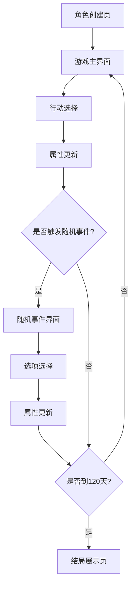

## 1. Product Overview
人生模拟器·高中副本是一款决策驱动型养成类Web游戏，以真实高中生活为叙事背景。
- 玩家通过自主决策和时间分配，体验完整的高中生活，培养角色各项属性，最终达成不同结局。
- 目标用户为喜欢养成类游戏的年轻玩家，市场价值在于提供沉浸式的虚拟高中体验。

## 2. Core Features

### 2.1 User Roles
| Role | Registration Method | Core Permissions |
|------|---------------------|------------------|
| 玩家 | 无需注册，直接进入游戏 | 游戏内所有功能 |

### 2.2 Feature Module
1. **角色创建页**：昵称设置，天赋选择
2. **游戏主界面**：属性面板，行动选择，时间显示
3. **随机事件界面**：事件描述，选项选择
4. **结局展示页**：最终属性，成就展示，结局文案

### 2.3 Page Details
| Page Name | Module Name | Feature description |
|-----------|-------------|---------------------|
| 角色创建页 | 昵称设置 | 允许玩家输入自定义游戏昵称 |
| 角色创建页 | 天赋选择 | 提供4种初始天赋供玩家选择，每种天赋对应不同属性成长倍率 |
| 游戏主界面 | 六维属性面板 | 展示成绩、心态、体力、人缘、才艺、运气六项核心数值，使用进度条和雷达图可视化 |
| 游戏主界面 | 行动选择 | 提供8种日常行动选项，玩家通过消耗行动点选择行动 |
| 游戏主界面 | 时间显示 | 显示当前游戏天数和剩余天数 |
| 随机事件界面 | 事件展示 | 每3天触发一次随机事件，展示事件描述和选项 |
| 随机事件界面 | 选项选择 | 玩家选择不同选项后，触发角色属性数值变化 |
| 结局展示页 | 属性总结 | 展示最终六维属性数值和雷达图 |
| 结局展示页 | 成就展示 | 展示玩家在游戏过程中解锁的成就 |
| 结局展示页 | 结局文案 | 根据最终属性组合，生成个性化结局文案 |

## 3. Core Process
玩家首先进入角色创建页面，设置昵称并选择天赋。进入游戏主界面后，玩家每天分配行动点进行不同活动，每次行动后属性会产生波动。每3天触发一次随机事件，玩家做出选择后属性会发生变化。游戏总时长为120天，结束后进入结局展示页面，根据最终属性组合展示对应结局。

## 4. User Interface Design
### 4.1 Design Style
- 主色调：蓝色系 (#1E40AF) 和橙色系 (#F97316) 作为主色和强调色
- 辅助色：白色 (#FFFFFF) 和浅灰色 (#F3F4F6) 作为背景色
- 按钮风格：圆角矩形，有轻微的3D效果和 hover 动画
- 字体：使用无衬线字体，标题 18-24px，正文 14-16px
- 布局风格：卡片式布局，清晰的信息层次
- 图标风格：扁平化图标，搭配适当的动画效果

### 4.2 Page Design Overview
| Page Name | Module Name | UI Elements |
|-----------|-------------|-------------|
| 角色创建页 | 整体布局 | 居中卡片式布局，顶部游戏标题，中间昵称输入框，底部天赋选择区域 |
| 游戏主界面 | 属性面板 | 顶部六维属性进度条，右侧雷达图，属性数值实时更新 |
| 游戏主界面 | 行动选择 | 中部网格布局的行动按钮，每个按钮显示行动名称和消耗点数 |
| 游戏主界面 | 时间显示 | 右上角显示当前天数/总天数，字体较大且醒目 |
| 随机事件界面 | 事件展示 | 弹出式模态框，顶部事件标题，中间事件描述，底部选项按钮 |
| 结局展示页 | 整体布局 | 全屏展示，顶部最终属性雷达图，中部成就列表，底部结局文案 |

### 4.3 Responsiveness
- 设计采用桌面优先原则，适配1024px以上屏幕
- 针对平板设备（768px-1023px）进行布局调整，保持核心功能可见
- 针对移动设备（767px以下）采用垂直布局，确保所有功能可访问

### 4.4 3D Scene Guidance
- 无3D场景需求，游戏以2D界面为主