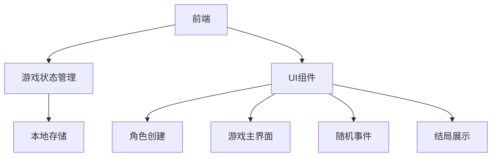
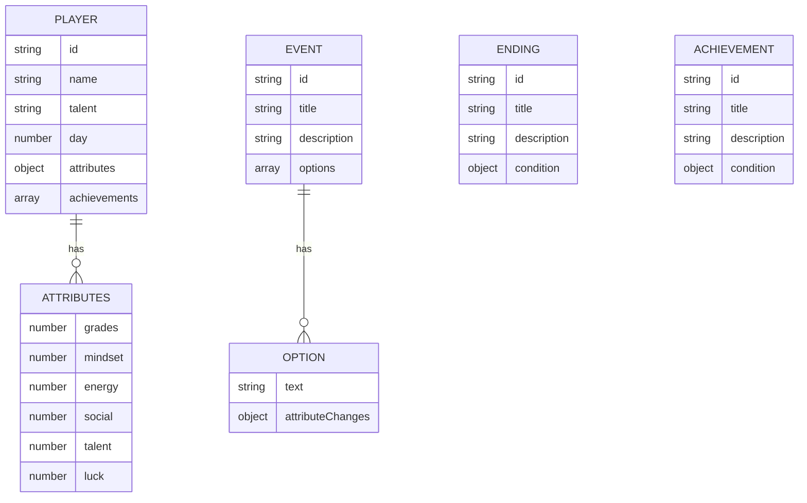

## 1. Architecture Design


## 2. Technology Description
- 前端：React@18 + TypeScript + Tailwind CSS + Vite
- 状态管理：Zustand
- 图表库：Recharts (用于雷达图)
- 本地存储：localStorage (用于保存游戏进度)
- 开发工具：Vite

## 3. Route Definitions
| Route | Purpose |
|-------|---------|
| / | 角色创建页面 |
| /game | 游戏主界面 |
| /event | 随机事件界面 |
| /ending | 结局展示页面 |

## 4. Data Model
### 4.1 Data Model Definition


### 4.2 Data Definition Language

#### 游戏状态数据结构
```typescript
interface Player {
  id: string;
  name: string;
  talent: string; // 天赋类型
  day: number; // 当前天数
  attributes: Attributes;
  achievements: string[]; // 成就ID列表
}

interface Attributes {
  grades: number; // 成绩 0-100
  mindset: number; // 心态 0-100
  energy: number; // 体力 0-100
  social: number; // 人缘 0-100
  talent: number; // 才艺 0-100
  luck: number; // 运气 0-100
}

interface Event {
  id: string;
  title: string;
  description: string;
  options: EventOption[];
}

interface EventOption {
  text: string;
  attributeChanges: Partial<Attributes>;
}

interface Ending {
  id: string;
  title: string;
  description: string;
  condition: {
    minGrades?: number;
    minMindset?: number;
    minEnergy?: number;
    minSocial?: number;
    minTalent?: number;
    minLuck?: number;
  };
}

interface Achievement {
  id: string;
  title: string;
  description: string;
  condition: {
    type: 'attribute' | 'event' | 'day';
    target: string;
    value: number;
  };
}
```

#### 天赋数据
```typescript
const talents = [
  {
    id: 'academic',
    name: '学术天才',
    description: '成绩属性成长倍率+20%',
    multipliers: { grades: 1.2, mindset: 1.0, energy: 0.9, social: 0.9, talent: 0.9, luck: 1.0 }
  },
  {
    id: 'social',
    name: '社交达人',
    description: '人缘属性成长倍率+20%',
    multipliers: { grades: 0.9, mindset: 1.0, energy: 1.0, social: 1.2, talent: 1.0, luck: 0.9 }
  },
  {
    id: 'creative',
    name: '艺术才子',
    description: '才艺属性成长倍率+20%',
    multipliers: { grades: 0.9, mindset: 1.0, energy: 0.9, social: 1.0, talent: 1.2, luck: 1.0 }
  },
  {
    id: 'lucky',
    name: '幸运儿',
    description: '运气属性成长倍率+20%',
    multipliers: { grades: 1.0, mindset: 1.0, energy: 1.0, social: 1.0, talent: 1.0, luck: 1.2 }
  }
];
```

#### 行动数据
```typescript
const actions = [
  {
    id: 'study',
    name: '学习',
    cost: 2,
    baseChanges: { grades: 3, mindset: -1, energy: -2, social: 0, talent: 0, luck: 0 }
  },
  {
    id: 'rest',
    name: '休息',
    cost: 1,
    baseChanges: { grades: 0, mindset: 2, energy: 5, social: 0, talent: 0, luck: 0 }
  },
  {
    id: 'socialize',
    name: '社交',
    cost: 2,
    baseChanges: { grades: -1, mindset: 1, energy: -2, social: 3, talent: 0, luck: 0 }
  },
  {
    id: 'practice',
    name: '才艺练习',
    cost: 2,
    baseChanges: { grades: -1, mindset: 0, energy: -3, social: 0, talent: 3, luck: 0 }
  },
  {
    id: 'exercise',
    name: '运动',
    cost: 2,
    baseChanges: { grades: 0, mindset: 2, energy: 3, social: 1, talent: 0, luck: 0 }
  },
  {
    id: 'read',
    name: '阅读',
    cost: 1,
    baseChanges: { grades: 2, mindset: 1, energy: -1, social: 0, talent: 1, luck: 0 }
  },
  {
    id: 'part-time',
    name: '兼职',
    cost: 3,
    baseChanges: { grades: -2, mindset: -1, energy: -4, social: 2, talent: 0, luck: 1 }
  },
  {
    id: 'explore',
    name: '探索',
    cost: 2,
    baseChanges: { grades: 0, mindset: 1, energy: -3, social: 1, talent: 1, luck: 2 }
  }
];
```

#### 随机事件数据
```typescript
const events = [
  {
    id: 'event1',
    title: '考试成绩公布',
    description: '你的期中考试成绩出来了，老师让你去办公室一趟。',
    options: [
      {
        text: '虚心接受批评，决心努力学习',
        attributeChanges: { grades: 5, mindset: -2, energy: 0, social: 0, talent: 0, luck: 0 }
      },
      {
        text: '无所谓，反正已经尽力了',
        attributeChanges: { grades: 0, mindset: 1, energy: 0, social: 0, talent: 0, luck: 0 }
      }
    ]
  },
  {
    id: 'event2',
    title: '社团招新',
    description: '学校社团开始招新了，你对哪个社团感兴趣？',
    options: [
      {
        text: '加入学习社团',
        attributeChanges: { grades: 3, mindset: 1, energy: -1, social: 1, talent: 0, luck: 0 }
      },
      {
        text: '加入艺术社团',
        attributeChanges: { grades: 0, mindset: 1, energy: -1, social: 2, talent: 3, luck: 0 }
      },
      {
        text: '加入体育社团',
        attributeChanges: { grades: 0, mindset: 1, energy: 2, social: 2, talent: 0, luck: 0 }
      }
    ]
  },
  // 更多随机事件...
];
```

#### 结局数据
```typescript
const endings = [
  {
    id: 'ending1',
    title: '学霸之路',
    description: '你的努力得到了回报，以优异的成绩考入了顶尖大学。',
    condition: { minGrades: 80, minMindset: 60 }
  },
  {
    id: 'ending2',
    title: '社交明星',
    description: '你在高中建立了广泛的人脉，成为了学校的风云人物。',
    condition: { minSocial: 80, minEnergy: 60 }
  },
  {
    id: 'ending3',
    title: '艺术大师',
    description: '你的才艺得到了认可，成为了学校的艺术之星。',
    condition: { minTalent: 80, minMindset: 60 }
  },
  {
    id: 'ending4',
    title: '平凡生活',
    description: '你度过了平静而充实的高中生活，为未来打下了坚实的基础。',
    condition: { minGrades: 60, minMindset: 60, minEnergy: 60, minSocial: 60, minTalent: 60, minLuck: 60 }
  },
  // 更多结局...
];
```

#### 成就数据
```typescript
const achievements = [
  {
    id: 'achievement1',
    title: '学业有成',
    description: '成绩达到90分以上',
    condition: { type: 'attribute', target: 'grades', value: 90 }
  },
  {
    id: 'achievement2',
    title: '社交达人',
    description: '人缘达到90分以上',
    condition: { type: 'attribute', target: 'social', value: 90 }
  },
  {
    id: 'achievement3',
    title: '坚持到底',
    description: '完成整个高中生活',
    condition: { type: 'day', target: 'day', value: 120 }
  },
  // 更多成就...
];
```